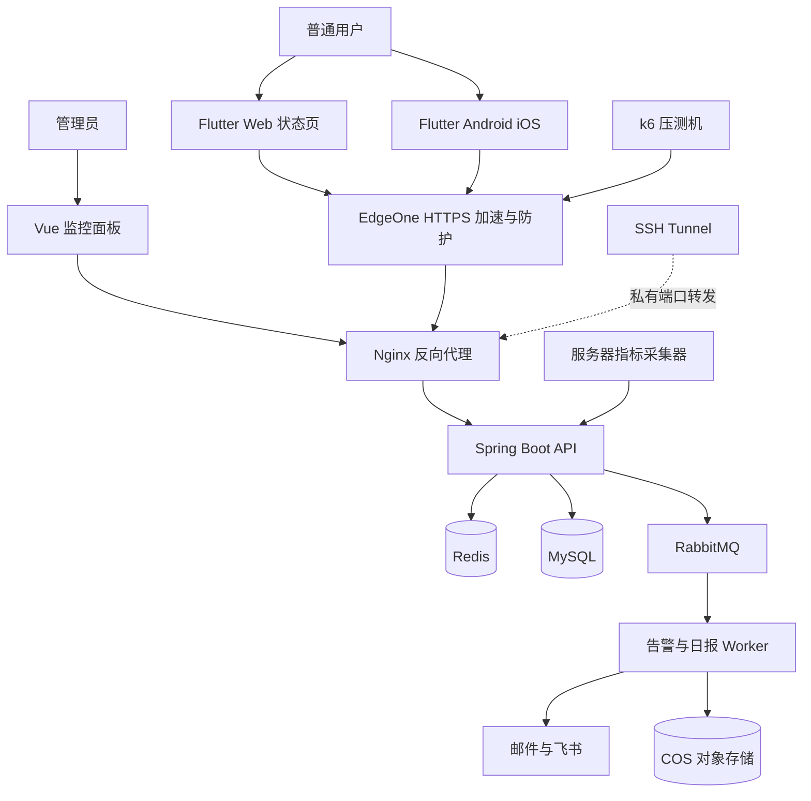

# Sentinel Monitor 项目架构与问题答案

## 1 项目目标

Sentinel Monitor 是一个小型服务器监控与告警平台，最终对外提供类似 Statuspage 的公共状态页，同时保留后端运维数据能力。用同一个项目练习第一波和第二波任务：Git 协作、Spring Boot、Flutter、Docker、SSH、Redis、RabbitMQ、性能测试、服务器巡检、Nginx、CDN、EdgeOne 和对象存储。

第一版不追求企业级复杂度，采用模块化单体加异步 Worker。目标是先跑通：

```text
服务器指标采集
→ Spring Boot 接收
→ Redis 保存最新状态、MySQL 保存历史数据
→ Vue/Flutter 展示
→ k6 压测并比较缓存效果
→ RabbitMQ 异步发送告警和日报
```

## 2 总体架构



## 3 组件职责

### Flutter 客户端

查看服务状态、告警和性能摘要。一个 Flutter 项目输出 Android、iOS 和 Web 三类目标。Android 先输出 APK/AAB；iOS IPA 需要 macOS、Xcode、Apple 证书和签名环境。

### Vue 监控面板

面向管理员，展示服务器、Docker 容器、接口 QPS、错误率、延迟分位数和 Redis 命中率。搜索框使用防抖，图表刷新和滚动事件使用节流。

### Spring Boot API

采用模块化单体：

```text
auth          用户和权限
server        服务器管理
service       被监控服务管理
metric        指标接收、聚合和查询
alert         告警规则和告警事件
cache         Redis 缓存封装
report        日报生成
notification  邮件和飞书通知
```

### 指标采集器

运行在被监控服务器上，每 10 到 30 秒采集 CPU、内存、磁盘、网络、Docker 和健康检查结果，再通过 HTTP 上报后端。采集器不负责展示，也不直接让浏览器执行服务器命令。

### 数据存储

- MySQL：服务器配置、服务配置、告警记录、日报记录和分钟级历史指标。
- Redis：服务器最新状态、服务摘要、热点查询结果和短期锁。
- RabbitMQ：告警通知和日报生成任务。
- COS：日报文件、安装包、图片和静态资源。

不要把每秒原始指标无限写入 MySQL。第一版保存最新状态和分钟级聚合数据即可。

## 4 部署结构

Docker Compose 规划：

```text
nginx
spring-api
notification-worker
mysql
redis
rabbitmq
monitor-web
```

公网只暴露 22、80、443。MySQL、Redis、RabbitMQ 只加入 Docker 内部网络；若为了 SSH Tunnel 调试端口，只绑定服务器的 `127.0.0.1`。

建议域名：

```text
status.example.com   Flutter Web 状态页
monitor.example.com  Vue 管理面板
api.example.com      Spring Boot API
assets.example.com   COS 和静态资源
```

## 5 数据流

### 监控数据

```text
采集器
→ POST /api/v1/metrics/ingest
→ 校验服务器身份
→ Redis 更新 latest 状态
→ MySQL 写入分钟聚合
→ 面板查询并展示
```

### Redis Cache-Aside

读取时先查 Redis；命中直接返回；未命中查 MySQL，写入 Redis 并设置 TTL。更新时先提交数据库，再删除缓存，避免长期返回旧数据。

还要考虑缓存穿透、缓存击穿、缓存雪崩和重复加载。可以使用空值缓存、TTL 随机值、互斥锁和热点 Key 保护。

### 告警与日报

```text
指标超过阈值
→ 写入 alert_event
→ RabbitMQ alert.events
→ Worker 消费
→ 发送邮件和飞书
```

日报使用定时任务生成，上传 COS 后把下载地址发送到群里。邮件系统优先使用现有 SMTP 服务，不从零搭建完整邮件服务器。

## 6 第一波问题答案

### 6.1 Git 分支和 PR 如何协作

Git 分支是代码的一条独立开发线。推荐流程：

```text
feature/xxx 或 fix/xxx
→ commit
→ push
→ Pull Request
→ lint、测试、AI 初审、人工审核
→ develop
→ release 测试和修复
→ tag 触发 GitHub Actions
→ 构建、部署、合并 main
```

`main` 保存稳定发布版本，`develop` 集成日常开发，`release` 只做发布前测试、版本号修改和小型 bugfix。发布完成后，release 需要分别合并回 main 和 develop，避免上线修复只存在于 main。

`gh` 是 GitHub 官方 CLI，可以在命令行创建 PR、查看 PR、读取审核状态和提交审核意见。

### 6.2 GitHub Actions、CI/CD 和 DevOps

- GitHub Actions：由提交、PR、tag 等事件触发的自动化工作流。
- CI：持续集成，自动执行格式检查、编译、测试和安全检查。
- CD：持续交付或持续部署，把通过检查的产物交付或部署到环境。
- DevOps：开发、测试和运维共同负责交付质量的一套文化、流程和工具。

### 6.3 Spring Boot 和 Flutter 中的框架

Java 和 Dart 是编程语言；Spring Boot 和 Flutter 是建立在语言之上的框架或开发平台。框架把常见的服务器、路由、数据库、渲染和平台适配工作封装起来，并通过约定和生命周期接管部分控制流程。

Spring Boot 典型四层：

```text
Controller  对外提供 HTTP 接口
Service     编写业务逻辑
Repository  访问数据库
Entity      描述数据实体
```

Flutter 以 Dart 为主要语言，提供 Widget、渲染和跨平台能力。Flutter Web 是一个浏览器目标；Flutter 移动端还需要和 Android/iOS 原生 API 交互。

### 6.4 Maven、Gradle、dependency 和 plugin

- 构建工具负责依赖解析、编译、测试、打包和任务编排。
- Maven 使用约定化的 `pom.xml` 管理依赖和生命周期。
- Gradle 使用构建脚本，表达能力更灵活。
- Maven dependency 是项目依赖的库，例如数据库驱动或 Redis 客户端。
- Flutter plugin 是给 Flutter 项目提供原生平台或第三方能力的插件。

### 6.5 Java、Flutter 和 JIT

Java 源代码先编译成字节码，由 JVM 加载、解释或即时编译后执行。JIT 是 Just-In-Time Compilation，在程序运行期间把热点代码编译成更高效的机器码。

Flutter 开发模式重视热重载和调试，Dart VM 会参与运行；发布模式会进行更强的优化，移动端通常使用 AOT 生成原生代码。具体构建方式取决于目标平台和 Flutter 版本。

### 6.6 WSL、Docker 和 Android 真机

WSL 为 Windows 提供 Linux 环境，Docker Desktop 可以把 Docker 引擎与 WSL 集成。Windows 用户可以在 WSL 中运行 Linux 工具链；macOS 用户一般直接使用类 Unix 环境，不需要 WSL。

Docker 不是完整虚拟机。容器通常共享 Linux 内核，通过命名空间、控制组等机制隔离进程和资源，因此比完整虚拟机更轻量。

Android 真机接入 WSL 的关键是 USB/ADB 通道。若直通不稳定，可以让 Windows 侧运行 ADB，再通过网络方式让 WSL 使用 ADB 服务。

### 6.7 Nginx、数据库和 CRUD

Nginx 可以作为反向代理，把不同域名转发给不同后端服务，也可以把流量分发到多个实例实现负载均衡。

关系型数据库使用表、行、列和约束表达结构化数据。MongoDB 是文档型、非关系型数据库，数据结构更灵活。Redis 是以内存为主的高速数据存储，常用于缓存、会话和限流。

Spring Boot CRUD 流程：

```text
Controller
→ Service
→ Repository
→ MySQL 或 MongoDB
→ 返回 DTO
```

### 6.8 SSH 和远程运维

SSH 用于远程登录、执行命令、端口转发和安全文件传输。公私钥认证中，私钥只保存在客户端，公钥放在服务器的 `authorized_keys` 中。

SSH 也可以让 AI 或 VS Code 连接远程服务器，但必须限制权限、保护私钥并审查执行命令。

### 6.9 事务隔离级别

事务要保证一组操作要么全部成功，要么全部失败。隔离级别从低到高通常是：

```text
Read Uncommitted
Read Committed
Repeatable Read
Serializable
```

隔离越强，一致性通常越好，但并发性能和锁竞争成本也可能更高。金融、订单、库存等场景不能只追求速度，要根据数据错误成本选择级别。

### 6.10 高内聚、低耦合和 lint

高内聚表示一个模块内部的职责集中；低耦合表示模块之间的依赖尽量少。一个函数只做一件事，是降低复杂度和提高可测试性的常见原则。

lint 是自动化代码规则检查，可以检查命名、空引用、文件长度、危险依赖、密钥泄露和格式。公司自定义 lint 通常是脚本，再由 GitHub Actions 调用；warning 是否阻断提交由团队规则决定。

## 7 第二波问题答案

### 7.1 Flutter 打包和 HTTPS

Android 可以输出 APK 或 AAB；iOS 使用 IPA，但需要 Apple 的签名环境。Flutter Web 使用 `flutter build web` 生成 `build/web`，再交给 Nginx、COS 或其他静态站点服务。

HTTPS 可以在 EdgeOne 或 Nginx 终止。部署时把 80 重定向到 443，并确保 EdgeOne 到源站也使用 HTTPS。

### 7.2 SSH Tunnel

本地端口转发示例：

```bash
ssh -N -L 127.0.0.1:18080:127.0.0.1:8080 user@server
```

访问本机 18080，就会通过加密 SSH 通道访问服务器的 8080。它适合临时访问不应暴露公网的后台、数据库和 Redis。

`-L` 是本地转发，`-R` 是远程转发，`-D` 是动态 SOCKS 转发。调试时应绑定 `127.0.0.1`，避免把隧道端口再次暴露给局域网。

### 7.3 Redis 缓存

Cache-Aside 的基本流程是：读缓存，未命中读数据库并回填；写数据库后删除缓存。必须记录命中率、未命中率和命中/未命中延迟，才能证明缓存是否有效。

### 7.4 P50、P90、P99 和 P99.9

P50 是中位数，P90 表示 90%的请求不超过该延迟，P99 表示 99%的请求不超过该延迟。题目中的 P999 通常应写成 P99.9。

长尾延迟可能来自慢查询、锁等待、GC、连接池耗尽、网络抖动、缓存失效、队列堆积和 CPU 饱和。P99.9 需要足够大的样本量，否则结论不稳定。

### 7.5 QPS 和压测

QPS 是每秒处理的请求数。压测应经过基准、递增、压力、峰值和长时间稳定性测试。重点记录 QPS、错误率、P50/P90/P99/P99.9、CPU、内存、磁盘、数据库连接池和 Redis 命中率。

本项目提供 `GET /api/v1/metrics/summary?windowSeconds=300`，记录最近 15 分钟 API 请求样本并返回 requestCount、QPS、5xx 数量和 P50/P90/P99/P999。它是教学用的轻量实现，生产环境应迁移到 Micrometer + Prometheus + Grafana。

当 QPS 不再增长、延迟快速升高或错误率明显上升时，说明出现性能瓶颈。压测机最好独立于被测服务器。

### 7.6 服务器资源巡检

- `top`/`htop`：进程、CPU 和负载。
- `free -h`：内存和可用内存。
- `iostat -xz 1`：磁盘等待、吞吐和利用率。
- `iftop`/`nload`：网络流量。
- `docker ps`：容器状态。
- `docker stats`：容器 CPU、内存、网络、Block I/O 和进程数。
- `df -h`：磁盘空间。
- `ss -lntp`：监听端口。
- `docker logs`/`journalctl`：服务日志。

Load Average 要结合 CPU 核数解释，不能脱离核数单独判断。

### 7.7 监控面板和日报

面板至少展示当前状态、趋势图、告警、QPS、错误率、延迟分位数、容器资源和 Redis 命中率。日报包含服务在线率、资源峰值、请求量、错误率、性能分位数、告警及恢复情况。

日报由定时任务生成，上传 COS 后通过 SMTP 和飞书发送。Token、SMTP 密码和域名密钥不能写进代码仓库。

本项目的 `ops/health-report.py` 已能聚合健康状态、在线服务器、活动事件、QPS、延迟分位数和 Docker 资源；设置 `FEISHU_WEBHOOK_URL` 后可以发送飞书群机器人。Linux systemd 的 service/timer 模板在 `ops/` 下，正式邮件系统仍需配置真实域名的 MX、SPF、DKIM、DMARC 和 SMTP 凭据。

### 7.8 消息队列和缓存

缓存主要减少重复读取和数据库压力；消息队列主要做异步解耦、削峰、重试和任务排队。

RabbitMQ 中生产者把消息发给 Exchange，Exchange 按规则路由到 Queue，消费者处理后 ACK。消费者需要考虑重复消息、重试和死信队列。

本项目使用 RabbitMQ 发送告警和日报；Kafka 作为后续了解大量事件流、日志流和消息重放时的扩展方向。

### 7.9 防抖和节流

- 防抖：连续触发时不断重新计时，停止触发一段时间后执行最后一次。适合搜索框。
- 节流：固定时间窗口内最多执行一次。适合滚动、缩放和周期性刷新。

例如搜索框使用 300ms 防抖；图表刷新或窗口 resize 使用 100～250ms 节流，具体数值根据体验测试调整。

### 7.10 CDN、EdgeOne 和对象存储

CDN 把静态资源缓存到靠近用户的节点，减少源站带宽和访问延迟。EdgeOne 在 CDN 加速之外，还提供动态加速、DDoS/CC 防护、Web 防护、Bot 管理、边缘函数、DNS 和四层代理等能力。

对象存储以 Bucket 和 Object 管理文件，适合图片、安装包、日志、日报和备份。文件存储提供目录式共享文件，块存储更像云硬盘，适合数据库和虚拟机磁盘。

本项目中 COS 存放 Flutter Web 产物、日报和安装包，EdgeOne 负责域名接入、静态资源加速和安全防护。敏感对象默认保持私有，使用临时签名 URL 下载。

## 8 验收标准

### 最小闭环

- 后端可以接收服务器指标。
- 面板可以显示服务器和服务状态。
- Docker 可以启动基础服务。
- Nginx 可以转发前后端请求。
- k6 可以得到 QPS、错误率和延迟分位数。

### 第二阶段

- MySQL 保存服务器最新快照，后端重启后数据仍可读取。
- Redis 使用 Cache-Aside 保存最新状态，并设置快照过期时间。
- Redis Cache-Aside 能够运行并有对比数据。
- RabbitMQ 能够异步发送告警。
- 日报能够生成并发送。
- SSH Tunnel 能够访问私有管理端口。

当前代码进度：MySQL 持久化、Spring Boot 服务 CRUD、MongoDB 练习容器、Redis Cache-Aside 与命中率统计、状态事件记录、订阅保存、RabbitMQ 异步告警、QPS/延迟分位数接口和公共 Status Page 已接入；Flutter Android/Web 标准客户端已经创建并调用同一套状态接口；GitHub Actions CI 已加入；Docker Compose 已通过健康检查启动 MySQL、MongoDB、Redis、RabbitMQ、Spring Boot、Vue/Nginx 网关；SSH Tunnel、服务器巡检和日报脚本已加入。本地默认配置仍使用内存降级，Docker Profile 使用 MySQL/Redis/RabbitMQ。Docker 环境已实测健康接口、状态接口、指标上报、服务 CRUD、Redis 命中、RabbitMQ 告警消费、缓存命中与未命中延迟对比和日报生成。

### 第三阶段

- Flutter Android/Web 构建成功。
- iOS IPA 在 macOS 或 CI 环境构建成功。
- COS 和 EdgeOne 完成静态资源部署。
- GitHub Actions 完成 lint、测试、构建和发布。

## 9 推荐学习和开发顺序

```text
Spring Boot API
→ Vue 面板
→ 指标采集器
→ Docker Compose
→ Redis
→ k6 压测
→ RabbitMQ 与日报
→ Flutter
→ COS、CDN、EdgeOne
→ CI/CD
```

## 10 参考资料

- [Flutter Web 发布](https://docs.flutter.dev/deployment/web)
- [Flutter Android 发布](https://docs.flutter.dev/deployment/android)
- [Flutter 持续交付](https://docs.flutter.dev/deployment/cd)
- [OpenSSH ssh 手册](https://man.openbsd.org/ssh)
- [Redis Cache-Aside](https://redis.io/docs/latest/develop/use-cases/cache-aside/)
- [k6 指标](https://grafana.com/docs/k6/latest/using-k6/metrics/reference/)
- [Docker stats](https://docs.docker.com/reference/cli/docker/container/stats/)
- [RabbitMQ AMQP 概念](https://www.rabbitmq.com/tutorials/amqp-concepts)
- [腾讯云 EdgeOne](https://cloud.tencent.com/document/product/1552)
- [腾讯云 COS](https://intl.cloud.tencent.com/pt/document/product/436)

